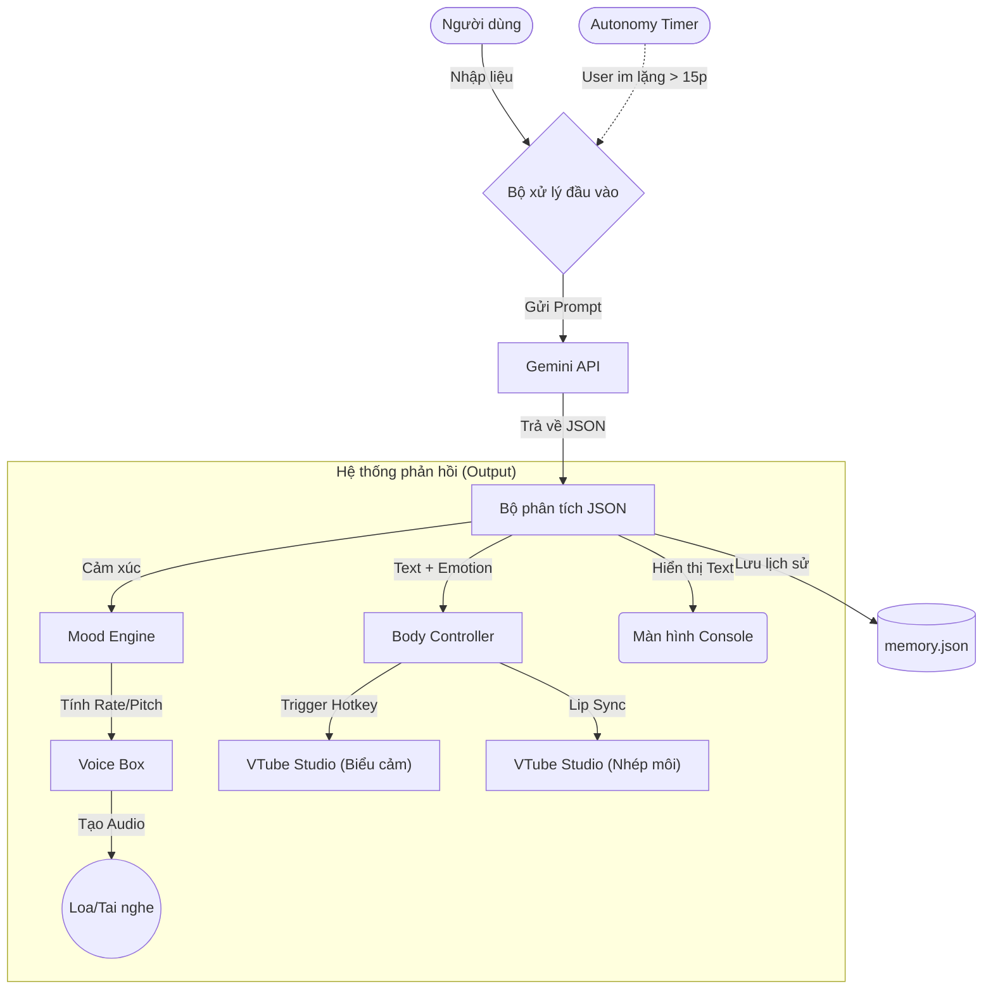

**Lưu ý: Nội dung dưới đây 90% là AI-Generated**

---

<h1 align="center">Not-Neuro AI VTuber</h1>
<p align="center">
  <i>Mục tiêu: Xây dựng một AI VTuber có khả năng tương tác tự nhiên như Neuro-sama. Đây là bước đặt nền móng về tư duy lập trình và xử lý ngôn ngữ tự nhiên (NLP) trong lộ trình 4 năm đại học.</i>
</p>

<p align="center">
  
  
  
  
</p>

---

## Tổng quan dự án
Dự án **Not-Neuro** là một nỗ lực nhằm tái hiện khả năng tương tác thông minh của Neuro-sama. Đây là đồ án giai đoạn Năm 1, hiện tại đã có thể kết nối với VTube Studio và sử dụng các biểu cảm đơn giản.

---

### Tech Stack (Công nghệ sử dụng)
<p align="left">
  <a href="https://python.org" target="_blank">  </a>
  <a href="https://ai.google.dev/" target="_blank">  </a>
  <a href="https://git-scm.com/" target="_blank">  </a>
</p>

---

## Kiến trúc hệ thống (Architecture)
Dưới đây là luồng xử lý dữ liệu của Not-Neuro:



---

## Tính năng hiện có
Dưới đây là những gì mà 1 Not-Neuro có thể làm hiện tại

* **Hệ thống phản hồi:** Sử dụng Gemini 2.5 Flash API (có thể sử dụng các model version khác).

* **Hệ thống lệnh (Command System):**

  * `/status`: Kiểm tra tình trạng kết nối và model.

  * `/reset`: Xóa sạch bộ nhớ tạm của AI.

  * `/help`: Xem danh sách lệnh.
 
  * `/exit`: Thoát chương trình.

* **Quản lý ký ức:** Lưu lịch sử chat vào file `memory.json`.

* **Bảo mật:** Quản lý API Key thông qua biến môi trường (`.env`).

* **Kết nối Cơ thể:** Điều khiển trực tiếp VTube Studio (Nhép môi, Biểu cảm vui/buồn/giận).

* **Chế độ Tự chủ (Autonomy):** Bot tự động bắt chuyện nếu bạn im lặng quá 15 phút.

* **Giọng nói (TTS):** Sử dụng ElevenLab API.

* <s> **Hệ thống Cảm xúc:** Giọng nói thay đổi tốc độ và cao độ tùy theo tâm trạng (Vui nói nhanh, Buồn nói chậm). </s> (Chỉ áp dụng khi dùng Edge-TTS)

---

## Hướng dẫn cài đặt và sử dụng

### Yêu cầu
- **Python 3.10** trở lên.
- **VTube Studio** (Cài trên Steam) đang bật.

### Cài đặt thư viện và khởi tạo môi trường
Để tránh xung đột thư viện, hãy chạy lệnh sau:
```bash
# Cài đặt các thư viện cần thiết
pip install google-genai python-dotenv pyvts elevenlabs pygame numpy
```

### Thiết lập API key
Vì lý do bảo mật, file chứa API Key không được upload lên GitHub. Bạn cần:

* Copy file `.env.example` và đổi tên thành `.env`.

* Mở file .env và dán API Key của bạn vào:
```Plaintext
GEMINI_API_KEY=Dán_Key_Của_Bạn_Ở_Đây
ELEVENLABS_API_KEY=Dán_Key_Của_Bạn_Ở_Đây
ELEVENLABS_VOICE_ID=Dán_ID_Của_Bạn_Ở_Đây
```

### Xin quyền điều khiển (Chạy 1 lần duy nhất)
Lần đầu tiên chạy, bạn cần xin phép VTube Studio:

```Bash
python vts_auth.py
```
Nhìn vào màn hình VTube Studio và bấm "Allow". Sau khi xong, file vts_token.txt sẽ được tạo ra.

### Khởi chạy chương trình
Sau khi cài đặt xong, bạn chỉ cần gõ:
```Bash
python brain.py
```

## Cấu trúc thư mục

```
Not-Neuro-chatbot/
├── main.py             # main
├── brain.py            # Bộ não (Xử lý hội thoại, Autonomy)
├── body.py             # Kết nối VTube Studio (PyVTS)
├── voice.py            # Xử lý giọng nói (TTS)
├── mood.py             # Hệ thống cảm xúc (Vector cảm xúc) (Edge-TTS)
├── vts_auth.py         # Script xin Token (Setup)
├── vts_token.txt       # Token kết nối (Tự tạo)
├── memory.json         # Bộ nhớ ngắn hạn
└── character_background.txt # Prompt tính cách nhân vật
```

---

## 🗺️ Lộ trình phát triển (4 Năm)

- [x] Năm 1: Xây dựng Logic AI & Hệ thống lệnh cơ bản.

- [x] Năm 2: Tích hợp Giọng nói (TTS) & Hình ảnh Live2D đơn giản.

- [ ] Năm 3: Xây dựng RAG (Bộ nhớ dài hạn) & Tích hợp Twitch Chat.

- [ ] Năm 4: Đồ án tốt nghiệp: Hoàn thiện nhân vật & Stream thực tế.

---

<p align="center"> From Mahirou with ❤️ - An AI freshman </p>
