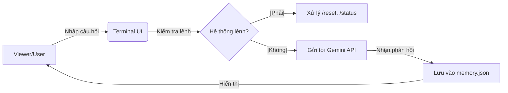

**Lưu ý: Nội dung dưới đây là AI-Generated**

---

<h1 align="center">🤖 Fake-Neuro AI VTuber (Phase 1: Brain & Command System)</h1>
<p align="center">
  <i>Mục tiêu: Xây dựng một AI VTuber có khả năng tương tác tự nhiên như Neuro-sama. Đây là bước đặt nền móng về tư duy lập trình và xử lý ngôn ngữ tự nhiên (NLP) trong lộ trình 4 năm đại học.</i>
</p>

<p align="center">
  
  
  
</p>

---

## 🌟 Tổng quan dự án
Dự án **Fake-Neuro** là một nỗ lực nhằm tái hiện khả năng tương tác thông minh của Neuro-sama. Đây là đồ án giai đoạn Năm 1, tập trung vào việc xây dựng "Bộ não" hội thoại xử lý qua Terminal với khả năng bảo mật và quản lý bộ nhớ.

---

### 🛠 Tech Stack (Công nghệ sử dụng)
<p align="left">
  <a href="https://python.org" target="_blank">  </a>
  <a href="https://ai.google.dev/" target="_blank">  </a>
  <a href="https://git-scm.com/" target="_blank">  </a>
</p>

---

## 🏗 Kiến trúc hệ thống (Architecture)
Dưới đây là luồng xử lý dữ liệu của Fake-Neuro:



---

## ✨ Tính năng hiện có
Dưới đây là những gì mà 1 Fake-Neuro có thể làm hiện tại

* **Hệ thống phản hồi:** Sử dụng Gemini 2.5 Flash API (tối ưu tốc độ cho máy cấu hình thấp).

* **Hệ thống lệnh (Command System):**

  * `/status`: Kiểm tra tình trạng kết nối và model.

  * `/reset`: Xóa sạch bộ nhớ tạm của AI.

  * `/help`: Xem danh sách lệnh.
 
  * `/exit`: Thoát chương trình.

* **Quản lý ký ức:** Lưu lịch sử chat vào file `memory.json`.

* **Bảo mật:** Quản lý API Key thông qua biến môi trường (`.env`).
 
---

## 📥 Hướng dẫn cài đặt và sử dụng

### 1️⃣ Cài đặt thư viện và khởi tạo môi trường
Để tránh xung đột thư viện, hãy chạy lệnh sau:
```bash
# Cài đặt các thư viện cần thiết
pip install -U google-genai python-dotenv
```
google-genai: SDK mới nhất để giao tiếp với bộ não AI.
python-dotenv: Giúp chương trình đọc Key bí mật từ file ẩn.

### 2️⃣ Thiết lâoj API key
Vì lý do bảo mật, file chứa API Key không được upload lên GitHub. Bạn cần:

* Copy file `.env.example` và đổi tên thành `.env`.

* Mở file .env và dán API Key của bạn vào:
```Plaintext
GEMINI_API_KEY=Dán_Key_Của_Bạn_Ở_Đây
```

### 3️⃣ Khởi chạy chương trình
Sau khi cài đặt xong, bạn chỉ cần gõ:
```Bash
python brain.py
```

---

## 🗺️ Lộ trình phát triển (4 Năm)

- [x] Năm 1: Xây dựng Logic AI & Hệ thống lệnh cơ bản.

- [ ] Năm 2: Tích hợp Giọng nói (TTS) & Hình ảnh Live2D đơn giản.

- [ ] Năm 3: Xây dựng RAG (Bộ nhớ dài hạn) & Tích hợp Twitch Chat.

- [ ] Năm 4: Đồ án tốt nghiệp: Hoàn thiện nhân vật & Stream thực tế.

---

<p align="center"> From Mahirou with ❤️ - An AI freshman </p>
